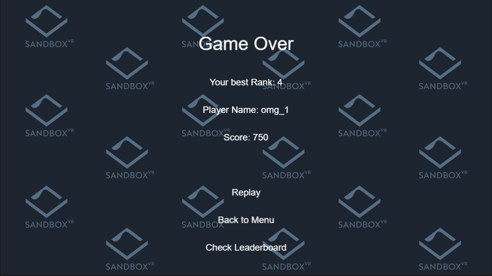

# Documentation

## Overview
The catcher game is a simple web game that is supported by a backend and another leaderboard to view top players rank and scores.
This aim to provide a lightweight and simplistic system that is easy to use and setup.
This catcher game Node.Js application system have 3 components: a backend server with db, game web app, leaderboard web app
<p align="center">
    
</p>

### Tech stack
game (port: 5000): Phaser 3

leaderboard (port 3000): React, socket.io

backend (port 80): express, ioredis, typeorm, socket.io

DB: SQlite

## Setup
To start this application suite, please start the backend first before starting the game and leaderboard.
For detail start up instructions, please refer to the `README.md` inside of each application folder.
Please run ```npm install``` first for the first time.
## DB schemas
<p align="center">
    
</p>

## Gameplay samples
The game will start with a simple menu, which can start the game or open leaderboard web app
<p align="center">
    
</p>
In the game the player has a 60 seconds timer to move the catcher to catch the items to get scores.
When the catcher catches an item it will produce a sound depending on the item caught. 
At the last 10 seconds, the timer will turn red to alert the player.
<p align="center">
    
    
</p>
When game ends it will prompt for player name. After game ends the player name, score and rank will be displayed. 
The player can replay again or go back to menu or check leaderboard
<p align="center">
    
</p>

## Game play flow
<p align="center">
    
</p>

## APIs
`POST /player`: create a player for first time users and give player id, will emit event to socket if a top play is added

request
```json
{
  "name": "test"
}
```
response
```json
{
  "id": 1,
  "name": "test"
}
```
if name is already taken, it will append a number at the end of name
```json
{
  "id": 1,
  "name": "test_1"
}
```

`POST /game`: create a game record for a player and get the best rank of the player
request
```json
{
  "playerId": 1,
  "score": 1000
}
```
response
```json
{
  "gameId": 1,
  "rank": 1
}
```
`GET /leaderboard`: get top 100 players score and name
response

```json
[
  {
    "id": 1,
    "name": "test",
    "score": 1000
  },
  {
    "id": 2,
    "name": "test_1",
    "score": 900
  },
  ...
]
```

The backend also provides a socket connection to get realtime leaderboard data with the same response as the above through `leaderboard` event,
which will be updated when a new game is submitted.